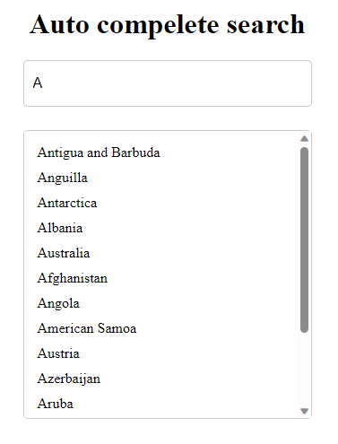

# React Countries search with TypeScript

## Table of Contents

- [Project Name](#project-name)
  - [Table of Contents](#table-of-contents)
  - [Description](#description)
  - [Screenshot](#screenshot)
  - [Installation](#installation)
  - [Features](#features)
  - [Technologies Used](#technologies-used)

## Description
This search app is built with React and TypeScript. It uses the [REST Countries API](https://restcountries.eu/) to fetch country data and display it to the user. The user can search for a country by name, and it displays autocomplete suggestions as the user types.
The search component contain debounce function to limit the number of API calls made to the server. It also uses the [React Bootstrap](https://react-bootstrap.github.io/) library for styling.

## Screenshot


## Installation

```bash
# Clone the repository
git clone https://github.com/salma247/react-countries-autocompelete-ts.git

# Change into the project directory
cd your-project

# Install dependencies
npm install

# Start the development server
npm start
```

## Features
- Search for a country by name
- Display autocomplete suggestions as the user types
- Display country name when a user selects a country from the autocomplete suggestions
- Debounce hook to limit the number of API calls made to the server

## Technologies Used

- [React](https://reactjs.org/)
- [TypeScript](https://www.typescriptlang.org/)
- [REST Countries API](https://restcountries.eu/)
- [React Bootstrap](https://react-bootstrap.github.io/)
